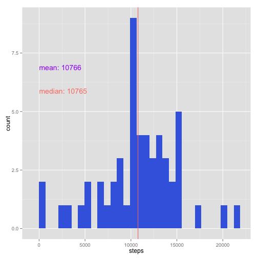
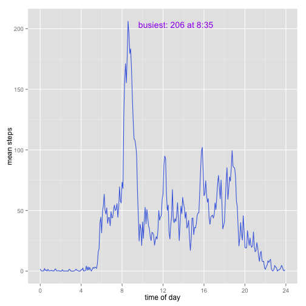
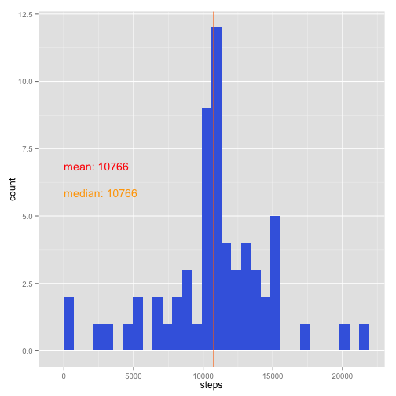
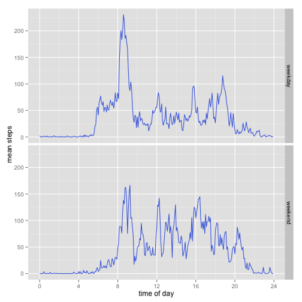

# Reproducible Research: Peer Assessment 1


## Loading and preprocessing the data

Download the file if it is not available locally.

```r
ZIP_URL = "https://d396qusza40orc.cloudfront.net/repdata%2Fdata%2Factivity.zip"
ZIP_FILE = "activity.zip"
if (!file.exists(ZIP_FILE)) download.file(ZIP_URL, ZIP_FILE, "curl", FALSE)
```


Unzip it.

```r
CSV_FILE = "activity.csv"
if (!file.exists(CSV_FILE)) unzip(ZIP_FILE, c(CSV_FILE), FALSE, TRUE, TRUE)
```

    
Load it.

```r
allData <- read.csv(CSV_FILE, colClasses = c("numeric", "Date", "numeric"))
allData$date <- as.Date(allData$date)
data <- allData[!is.na(allData$steps), ]
summary(data)
```

```
##      steps            date               interval   
##  Min.   :  0.0   Min.   :2012-10-02   Min.   :   0  
##  1st Qu.:  0.0   1st Qu.:2012-10-16   1st Qu.: 589  
##  Median :  0.0   Median :2012-10-29   Median :1178  
##  Mean   : 37.4   Mean   :2012-10-30   Mean   :1178  
##  3rd Qu.: 12.0   3rd Qu.:2012-11-16   3rd Qu.:1766  
##  Max.   :806.0   Max.   :2012-11-29   Max.   :2355
```


## What is mean total number of steps taken per day?

Summarize by day

```r
daily <- aggregate(list(steps = data$steps), by = list(date = data$date), FUN = sum)
dailyMean <- mean(daily$steps)
dailyMedian <- median(daily$steps)
```


```r
library(ggplot2)
with(daily, {
    ggplot(daily, aes(x = steps)) + geom_histogram(fill = "royalblue") + geom_vline(xintercept = dailyMean, 
        col = "purple") + annotate("text", label = paste("mean:", round(dailyMean)), 
        x = 0, y = 7, hjust = 0, vjust = 1, col = "purple") + geom_vline(xintercept = dailyMedian, 
        col = "salmon") + annotate("text", label = paste("median:", dailyMedian), 
        x = 0, y = 6, hjust = 0, vjust = 1, col = "salmon")
})
```

```
## stat_bin: binwidth defaulted to range/30. Use 'binwidth = x' to adjust this.
```

 


## What is the average daily activity pattern?

Intervals are in the range 0:59, which would leave gaps when graphed as a continuous value.  We need something to convert to fractional time.


```r
fracTime <- function(d) {
    (d%/%100) + (d%%100)/60
}
```


A helper to pretty-print interval times for our plot would be nice.


```r
formatInterval <- function(x) {
    h <- x%/%100
    m <- x%%100
    if (m < 10) 
        m <- paste0("0", m)
    paste0(h, ":", m)
}
```


Summarize by interval.


```r
byInterval <- aggregate(list(steps = data$steps), by = list(interval = data$interval), 
    FUN = mean)
byInterval$dateFrac <- fracTime(byInterval$interval)
busiest <- byInterval[byInterval$steps == max(byInterval$steps), ]
```


Plot it.


```r
note <- paste("busiest:", round(busiest$steps), "at", formatInterval(busiest$interval))
with(byInterval, {
    ggplot(byInterval, aes(x = dateFrac, y = steps)) + geom_line(col = "royalblue") + 
        annotate("text", label = note, x = (busiest$dateFrac) + 1, y = busiest$steps, 
            hjust = 0, vjust = 1, col = "purple") + xlab("time of day") + ylab("mean steps") + 
        scale_x_continuous(breaks = seq(0, 24, by = 4), labels = floor)
})
```

 


## Imputing missing values

Missing values: 17568

Think like a database programmer and merge the original (sparse) data with the aggregated daily data.


```r
withDaily <- merge(allData, byInterval, by = "interval", sort = FALSE, suffixes = c(".all", 
    ".dailymean"), all.x = TRUE)
```


This destroys the ordering, so put it back.


```r
imputed <- withDaily[with(withDaily, order(date, interval)), c("date", "interval", 
    "steps.all", "steps.dailymean")]
```


Fill in the holes.


```r
imputed$steps <- ifelse(is.na(imputed$steps.all), imputed$steps.dailymean, imputed$steps.all)
```


Calculate the new mean & median.


```r
imputedDaily <- aggregate(list(steps = imputed$steps), by = list(date = imputed$date), 
    FUN = sum)
imputedMean <- mean(imputedDaily$steps)
imputedMedian <- median(imputedDaily$steps)
```


Chart.


```r
with(imputedDaily, {
    ggplot(imputedDaily, aes(x = steps)) + geom_histogram(fill = "royalblue") + 
        geom_vline(xintercept = imputedMean, col = "red") + annotate("text", 
        label = paste("mean:", round(imputedMean)), x = 0, y = 7, hjust = 0, 
        vjust = 1, col = "red") + geom_vline(xintercept = imputedMedian, col = "orange") + 
        annotate("text", label = paste("median:", round(imputedMedian)), x = 0, 
            y = 6, hjust = 0, vjust = 1, col = "orange")
})
```

```
## stat_bin: binwidth defaulted to range/30. Use 'binwidth = x' to adjust this.
```

 


As we are imputing the missing data from the average, and only entire days are missing instead of sparse intervals, there is no significant impact to the daily average.


```r
lift <- merge(imputedDaily, daily, by = "date", suffixes = c(".imputed", ".all"), 
    all.x = TRUE)
lift$lift <- lift$steps.imputed - ifelse(is.na(lift$steps.all), 0, lift$steps.all)
partiallyLifted <- lift[lift$lift > 0 & !is.na(lift$steps.all), ]
nrow(partiallyLifted)
```

```
## [1] 0
```


There are 0 partially-lifted rows, meaning that for each entire missing day an average day was substituted in its place.

## Are there differences in activity patterns between weekdays and weekends?

Start with a helper function to make a factor for the day of the week.


```r
weekdayFactor <- function(d) {
    wd <- (as.POSIXlt(d))$wday
    ifelse(wd == 0 | wd == 6, "weekend", "weekday")
}
```


Add the factor to the imputed dataset and summarize it by day.


```r
imputed$weekday <- weekdayFactor(imputed$date)
imputedByInterval <- aggregate(list(steps = imputed$steps), by = list(interval = imputed$interval, 
    weekday = imputed$weekday), FUN = mean)
imputedByInterval$dateFrac <- fracTime(imputedByInterval$interval)
```


Nothing left to do but plot it out.


```r
with(imputedByInterval, {
    ggplot(imputedByInterval, aes(x = dateFrac, y = steps)) + facet_grid(weekday ~ 
        .) + geom_line(col = "royalblue") + xlab("time of day") + ylab("mean steps") + 
        scale_x_continuous(breaks = seq(0, 24, by = 4), labels = floor)
})
```

 


A few guesses could be made to explain the differences:

 * The subject sleeps in on the weekends.  No kids?
 * The subject spends a significant amount of time walking around on weekday mornings but then is relatively sedentary through the workday, as one might expect of a desk job.
